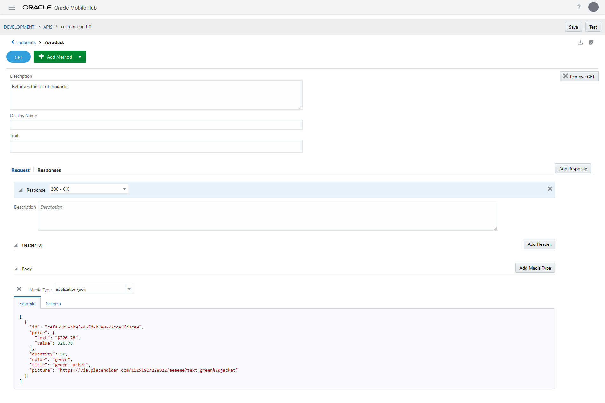

# Setup Development Enviornment with Oracle Mobile Hub
Oracle Mobile Hub (OMH) is a PaaS middleware with mobile ready built-in APIs. Product has evolved from Mobile Cloud Services (MCS), Oracle Mobile Cloud Enterprise (OMCE) and Autonomous Mobile Cloud Enterprise (AMCE) to be the todays Oracle Mobile Hub.
OMH custom APIs are basically developed with [Node.js](https://nodejs.org) and [Express](https://expressjs.com/). Once it is deployed to cloud, a [Docker container](https://www.docker.com/resources/what-container) is automatically built by the system in the cloud and it is runing as many instances as it is needing. At this step debugging of the running system is not possible except trying to understand the causing problems from diagonistics and logs.
Setting up a development enviornment for OMH is essential for traditional debugging.

# Get started
In order to start with OMH custom API development following things are required:
- A computer running Windows or Mac (OSX) or Linux with stable internet connection
- [Node.js 8.9.4](https://nodejs.org/dist/v8.9.4/) 
    - Using [nvm](https://github.com/nvm-sh/nvm) is strongly advised. It is also available for [windows](https://github.com/coreybutler/nvm-windows)
    - The document is written assuming nvm is being used. If nvm is being used, no need to dowload node from the link above
- A Node.js debugging capable IDE/Editor. Feel free to use any editor of your choice
    - This document is prepared with [Visual Studio Code](https://code.visualstudio.com/download)
- [OMCE Tools](https://www.oracle.com/technetwork/topics/cloud/downloads/amce-downloads-4478270.html)
    - This document is written with v18.3.1
- In order to start with custom API development, a scaffold of the Custom API is reqired. Knowledge of [Custom API](https://docs.oracle.com/en/cloud/paas/mobile-hub/develop/custom-api-design.html#GUID-92703CA0-893D-4245-AF0E-A482886EBC95) is will be useful
- [Git](https://git-scm.com/download/) is optional

# Node.js Setup
After installing nvm, in order to install specific version (8.9.4) of Node.js via nvm, open command line or terminal write the following:
```shell
nvm i 8.9.4
```
If there are other node versions are installed:
```shell
nvm alias default 8.9.4
```
If you are not sure, you can check versions via:
```shell
nvm ls
```
It is also advised to use the latest version of [npm](http://npmjs.com/) with that specific version of node
```shell
npm i -g npm
```

# Setup Folders
Create a workspace folder. Within that folder create the following folders:
- `omce-tools`: This is created by extracting OMCE Tools
- `source`: This is created by extracting scaffold of the API

If there is a need to work with more than one API at once, it is possible to extract each scaffold into separate folder and name the _source_ folder by API name such as _API1_, _API2_ respectively. The steps done within _source_ folder are to be repeated for each API folder respectively.  
Later `.vscode` folder will be created by Visual Studio Code.  
Folders might look like this:  


# OMCE Tools
There are two folders within OMCE Tools:
1. `omce-tools`: Helper program to run, test and deploy custom API code within your computer
2. `OracleMobileAPI`: Helper API to invoke platform APIs and Connectors remotely


## OracleMobileAPI
If _OracleMobileAPI_ is not created as API on your OMH instance following steps explain how to create it. This API is for the development purpose. If multiple OMH instnaces is used for different purposes (development, production) it is not advised to setup this on production.

1. Create New API > API
2. Upload `OracleMobileAPI.raml`. This will fill `API Display Name` and `API Name` automatically, write a short description and press `Create` button.
3. Open the OracleMobileAPI and go to Implementation tab
4. Upload `OracleMobileAPIImpl.zip`

For each backend there is a need to associate this OracleMobileAPI to be used:
1. Open desired backend
2. Go to APIs tab
3. Press `Select APIs`
4. Press to the `+` sign to the bottom right of OracleMobileAPI

## omce-tools
`${workspaceFolder}` stands for full path of your workspace folder.  
Omce tools is a node.js based program. In oder to set it up, open a command line or terminal within `${workspaceFolder}/omce-tools/omce-tools`
```shell
npm i -g
cd node-configurations
cd 8.9
npm i
```
This is setting up omce-tools both locally and globally.
- If you do not want to set it up local only, remove the `-g` from the first command
- If you want to use it globally, following steps needs to be taken:
    - **Windows**
        1. Edit the system environment variables
        2. Enter new record for user: `NODE_PATH` = `${workspaceFolder}\omce-tools\omce-tools\node-configurations\8.9\node_modules`
        3. New command line windows will benefit from this change
    - **Mac** or **Linux**
        1. Edit your `~/.bashrc` file (assuming bash is your primary terminal). It is possible to use VScode to edit your file using the following command: `code ~/.bashrc`
        2. Enter the following line to the end of the file: `export NODE_PATH=${workspaceFolder}/omce-tools/omce-tools/node-configurations/8.9/node_modules`
        3. New (bash) terminals will benefit from this change. It is possible to apply the same by entering the same line above to the current terminal

# Setup Git
Assuming git installation is complete and if git is to be used from command line command line user setup is also complete.

`.gitignore` file marks which files to be added or ignored to by the git system. It is advised to configure you _.gitignore_ file from this template below:
```
node_modules
/.vscodeIcon
/Icon*
/sample/*.json
desktop.ini
```

# Setup Visual Studio Code
There are several things to be installed within Visual Studio code:

## VScode Setup
- Install [RAML extension](https://marketplace.visualstudio.com/items?itemName=blzjns.vscode-raml)
    - This extension also uses [raml2html](https://www.npmjs.com/package/raml2html). Also run the following from command line or terminal: `npm i -g raml2html`
- If asked from windows which terminal to use, using git-bash is advised

## Project Configuration
VScode stores launch configuration within `.vscode/launch.json` file. Please create or modify the `${workspaceFolder}/.vscode/launch.json` file as below:
```json
{
    // Use IntelliSense to learn about possible attributes.
    // Hover to view descriptions of existing attributes.
    // For more information, visit: https://go.microsoft.com/fwlink/?linkid=830387
    "version": "0.2.0",
    "configurations": [
        {
            "type": "node",
            "request": "launch",
            "name": "Run Server",
            "linux": {
                "cwd": "${workspaceFolder}/source",
                "program": "${workspaceFolder}/source/run-server.js"
            },
            "windows": {
                "cwd": "${workspaceFolder}\\source",
                "program": "${workspaceFolder}\\source\\run-server.js"
            },
            "osx": {
                "cwd": "${workspaceFolder}/source",
                "program": "${workspaceFolder}/source/run-server.js"
            },
            "runtimeVersion": "8.9.4"
        },
    ]
}
```

- **name** is the name to run thac custom API. If more than one API is to be debugged within the same workspace, feel free to add more configuration into the array with different name. Also change the path of the program respectively
- **runtimeVersion** is ensured by calling `nvm` automatically within the VScode. If nvm is not to be used, please remove that line
- **run-server.js** is explained later below

# Source Folder
After extracting scaffold into source folder it will look like this:  


- **custom_api.js** and **custom_api.raml** can be on a different name based on your API name
- **toolsConfig.json** is the configuration file to be populated which the **omce-tools** are using to communicate with OMH cloud services. Some of the values are pre-populated by the custom API, some of them are to be obtained from the Web Console. Details are explained below
- Most of the files are populated by the entries from API data (endpoints, schema, types, traits)
- **custom_api.js** is the entry point for your endpoint code (responding with mock data entered from web console)
- **package.json** is the regular node.js/npm pacckage.json file addional OMH run-time configuration and dependencies are placed

## toolsConfig.json
The template obtained from scaffold will look like this:
```json

{
    "apiName":"custom_api",
    "apiVersion":"1.0",
    "apiId":"<API_ID>",
    "baseUrl":"<BASE_URL>",
    "tokenEndpoint":"<TOKEN_ENDPOINT>",
    "backend":{
        "backendId":"<YOUR_BACKEND_ID>",
        "backendName":"<YOUR_BACKEND_NAME>",
        "backendVersion":"<YOUR_BACKEND_VERSION>",
        "authorization":{
            "anonymousKey":"<BACKEND_ANONYMOUS_KEY>",
            "clientId":"<BACKEND_CLIENT_ID>",
            "clientSecret":"<BACKEND_CLIENT_SECRET>"
        }
    },
    "tools":{
        "deployment":{
            "tempDirectory":"c:\\tmp\\mcs-deploy"
        },
        "authorization":{
            "clientId":"<OMCE_TM_APP_CLIENT_ID>",
            "clientSecret":"<OMCE_TM_APP_CLIENT_SECRET>"
        }
    },
    "container":{
        "oracleMobileApiName":"OracleMobileAPI",
        "port":4000
    }
}
```

- **API_ID**, **BASE_URL**, **TOKEN_ENDPOINT** are filled from the scaffold. They are hidden for security reasons within this document
- **apiName** is set while creating the API on OMH web console
- **apiVersion** is the same version of the API (not the implementation version)
- Under `backend` section; **backendId**, **backendName**, **backendVersion**, **anonymousKey**, **clientId**, **clientSecret** are obtained from the desired backend settings section:
    1. Open desired backend
    2. Go to settings tab
    3. Reveal keys  
    
- Under `tools` **clientId** and **clientSecret** are obtained from main `Development` page within the web console by pressing `Instance Details`. `Team Member App Client ID` is the **clientId**, reveal `Team Member App Client Secret` is the **clientSecret**  

- **tempDirectory** is the folder where the temporary files are stored:
    - It is optional to change that folder on **windows**
        1. Open command line
        2. enter `echo %temp%`
        3. Use the displayed path as value, replaces all single backslashes `\` with double backslashes `\\` (backslash is an escape character)
        4. Add `\\mcs-deploy` as the final value. It will be something like: `C:\\Users\username\\AppData\\Local\\Temp\\mcs-deploy`
    - On **Mac** or **Linux** it needs to be replaced with: `/tmp/mcs-deploy`
- **oracleMobileApiName** is the name of the API that this tool is using to talk with OMH Cloud Service. It is the same value that has been entered previously while creating _OMCE Tools_ > _OracleMobileAPI_. There no need to change the value here
- **port** is the value of the TCP port which the API is to listen requests on your local computer. You can change the value as it fits to your needs. It is important to know the port value while invoking API call while running on your computer
- **tests** are the name of the tests automatically generated to be used for the tool to invoke a call. Each test is named in `<method><Endpoint name>` Some of the values are to be updated for the desired test effect. If you do not see tests section, it is not a mistake, your API has no endpoint-method defined. Tools will continue to run without tests section, just it cannot execute test from command line

Any value entered here has no effect running the code on the deployed API implementation, this is soley used for the omce-tools that simulates OMH on your local computer.

The values entered to the json file is not sufficient. There are several more changes to be performed. Please use the updated template below:

```json
{
    "apiName":"custom_api",
    "apiVersion":"1.0",
    "apiId":"<API_ID>",
    "baseUrl":"<BASE_URL>",
    "tokenEndpoint":"<TOKEN_ENDPOINT>",
    "backend":{
        "backendId":"<YOUR_BACKEND_ID>",
        "backendName":"<YOUR_BACKEND_NAME>",
        "backendVersion":"<YOUR_BACKEND_VERSION>",
        "authorization":{
            "anonymousKey":"<BACKEND_ANONYMOUS_KEY>",
            "clientId":"<BACKEND_CLIENT_ID>",
            "clientSecret":"<BACKEND_CLIENT_SECRET>"
        }
    },
    "authorization": {
        "mobileBackendID": "<YOUR_BACKEND_ID>",
        "anonymousKey": "<BACKEND_ANONYMOUS_KEY>",
        "oauth": {
            "tokenEndpoint": "<TOKEN_ENDPOINT>",
            "clientId": "<BACKEND_CLIENT_ID>",
            "clientSecret": "<BACKEND_CLIENT_SECRET>"
        },
        "token": "Basic <BACKEND_ANONYMOUS_KEY>"
    },
    "tools":{
        "deployment":{
            "tempDirectory":"c:\\tmp\\mcs-deploy"
        },
        "authorization":{
            "clientId":"<OMCE_TM_APP_CLIENT_ID>",
            "clientSecret":"<OMCE_TM_APP_CLIENT_SECRET>"
        }
    },
    "container":{
        "oracleMobileApiName":"OracleMobileAPI",
        "port":4000
    }
}
```
- **authorization** section is added. Most of the values are same from **backend**
    - **token** value starts with `Basic` separeted with a space ( ) and ends with the `<BACKEND_ANONYMOUS_KEY>`.

If you are accessing internet via proxy, in that case please refer to the tools documentation how to set proxy values within toolsConfig.json

Those changes might be obsolote in future versions of OMH and the tool, anyway it will not break anything

## package.json
package.json from scaffold looks like the following:
```json
{
  "name" : "custom_api",
  "version" : "1.0.0",
  "description" : "custom api",
  "main" : "custom_api.js",
  "oracleMobile" : {
    "dependencies" : {
      "apis" : { },
      "connectors" : { }
    }
  }
}
```
- **name** is the name of the implementation. The name could be different based on your API name
- **version** is the version of the implementation package. Do not confuse this with the API version. When deployed it will look like this:  

- **oracleMobile** values are parsed for the run-time.
    - **dependencies** of API and Connectors are entered corresponding sections. They are entered as key-value pairs. Key is the name, value is the version of the resource. Key is a combination of a path. See the example below
    `<Connector Name>` above is to be replaced with actual name. This is repeated for each connector as the api
- **configuration** section is not provided within the scaffold. This sets the container build configuration when deployed
    - **node** value should be `8.9`. This is important! Otherwise deployed code will work differently than running on your computer. This is also has an effect of other non-controlled packages, such as express.js
- **main** is the main execution file. Feel free to modify that value with actual server entry point
- **description** is the package description. Feel free to modify that value.

```json
{
    "name" : "custom_api",
    "version" : "1.0.0",
    "description" : "custom api",
    "main" : "custom_api.js",
    "oracleMobile" : {
        "dependencies" : {
        "apis" : {
                "/mobile/custom/<Custom API Name>" : "1.0"
            },
        "connectors" : {
                "/mobile/connector/<Connector Name>": "1.0"
            }
        }
    },
    "configuration": {
        "node": "8.9"
    },
}
```

## run-server.js
Local version of the custom API is to be run by the omce-ccc program (custom code container). It is possible to use an external debugger to debug the code. Using a wrapper to start the program with built-in IDE debugger will ease the process. The `run-server.js` file is the wrapper file for that purpose.  
Copy the content of the file as `"${workspaceFolder}/source/run-server.js`
```javascript
#!/usr/bin/env node
const path = require("path");
process.argv.splice(2, 0, "./toolsConfig.json", "--verbose");

const omceToolsNodePaths = path.join.apply(path, [__dirname].concat("../omce-tools/omce-tools/node-configurations/8.9/node_modules".split("/")));
process.env.NODE_PATH = process.env.NODE_PATH ? process.env.NODE_PATH + path.delimiter + omceToolsNodePaths : omceToolsNodePaths;
require("module").Module._initPaths();
process.mainModule = Object.assign({}, process.mainModule, {
    filename: path.join.apply(path, [__dirname].concat("../omce-tools/omce-tools/omce-ccc-impl.js".split("/")))
});
return require("../omce-tools/omce-tools/omce-ccc-impl");
```
Starting debug from this file will automatically:
- setup `NODE_PATH` environment variable
- `toolsConfig.json` is automatically picked up
- `main` entry point from the `${workspaceFolder}/source/package.json` is automatically run

For information regarding omce tools and original ccc, please read the `README.md` file within omce-tools

In the `launch.json` file this file is pointed to start with debug. Just press start or F5 to start debugging

# Simple debug case
Starting the API will just start the server which listens to given port (above in toolsConfig.json). In order to capture the calls:
1. An endpoint with method needs to be defined

This will generate a js file like this:
```javascript
/**
 * The ExpressJS namespace.
 * @external ExpressApplicationObject
 * @see {@link http://expressjs.com/3x/api.html#app}
 */ 

/**
 * Mobile Cloud custom code service entry point.
 * @param {external:ExpressApplicationObject}
 * service 
 */
module.exports = function(service) {


	/**
	 *  The file samples.txt in the archive that this file was packaged with contains some example code.
	 */


	service.get('/mobile/custom/custom_api/product', function(req,res) {
		var result = {};
		var statusCode = 200;
		if (statusCode == 200){
			var acceptType = req.accepts(['application/json']);
			if (acceptType == 'application/json'){
				result = [
					  {
					    "id": "cefa55c5-bb9f-45fd-b380-22cca3fd3ca9",
					    "price": {
					      "text": "$326.78",
					      "value": 326.78
					    },
					    "quantity": 50,
					    "color": "green",
					    "title": "green jacket",
					    "picture": "https://via.placeholder.com/112x192/228B22/eeeeee?text=green%20jacket"
					  }
					];
			}
		}
		res.status(statusCode).send(result);
	});

};

```
2. Place a debugger at listening part; place it on the line of  ```var result = {};```
3. A HTTP client needs to call that endpoint. You can use cURL, Postman or a browser.  
Main URL template is: `http://localhost:<port>/mobile/custom/<api-name>/<resource-path>`
```shell
curl -X GET http://localhost:4000/mobile/custom/custom_api/product
```

